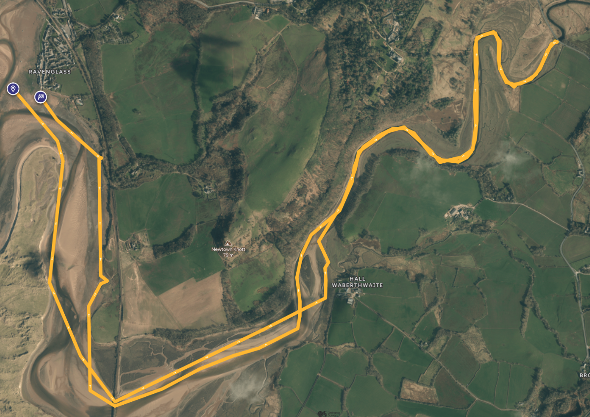

## Paddler Info 2025
Launch at Ravenglass (CA18 1SQ)

- Registration: 10:00 to 11:30
- Briefing: 11:45
- Race Start: 12:15
- High Tide: 13:53
- Race Finish: 15:15

### Links
- [Copeland Canoe Event Page](https://www.copelandcanoe.org.uk/c-seaquest.html)
- [Ravenglass Location Map](files/Ravenglass.pdf)
- [Seaquest_2024](files/seaquest_2024.jpeg)
- [Seaquest_Safety_check_list25](files/Seaquest_Safety_check_list25.docx)
- [Seaquest_SQ-entryform2025](files/Seaquest_SQ-entryform2025.docx)
- [Seaquest_SQ18thRavenglassSeaquest-Info2025](files/Seaquest_SQ18thRavenglassSeaquest-Info2025.docx)

## Maps!
- [Race Location on Google Map](https://maps.app.goo.gl/s3fp1QWgiNiX8WS57)
- [Seaquest_2024](files/seaquest_2024.jpeg)

### Esk (12.6km :: 210pts ::: 16.66pts/km)

### Irt (4.23km  :: 120pts ::: 28.4pts/km)

### Mite (3km :: 60pts ::: 20pts/km)

# Webcams
- [The Railway :-)](https://ravenglass-railway.co.uk/webcam)
- [Black Combe Weather Webcam - cycles around to the beach](http://www.blackcombeweathercam.uk)

## Weather
- [BBC](https://www.bbc.co.uk/weather/2639599)
- [Accuweather](https://www.accuweather.com/en/gb/ravenglass/ca18-1/weather-forecast/327512)
- [Met Office](https://weather.metoffice.gov.uk/forecast/gctt4yz59#?date=2025-07-13)
- [Weather.com](https://weather.com/en-GB/weather/weekend/l/d1135686814341a2bd723f924183853f92b3d1d59bbf2a78582e2049bce3d48e)
- [Weather Underground](https://www.wunderground.com/hourly/gb/ravenglass/date/2025-7-13)

## Campsite
- [Shepards View, Seascale](https://shepherdsviewsholidays.co.uk): Very close and a warm welcome :-)
- [Church Stile](https://www.churchstile.com): Cute but a modest drive away

## Local stuff
- [Muncaster Castle](https://www.muncaster.co.uk)
- [Hallsenna Moor](https://www.woodlandtrust.org.uk/visiting-woods/woods/hallsenna-moor/)
- [Ravenglass Railway and Cafe](https://ravenglass-railway.co.uk/plan-your-visit/facilities)
